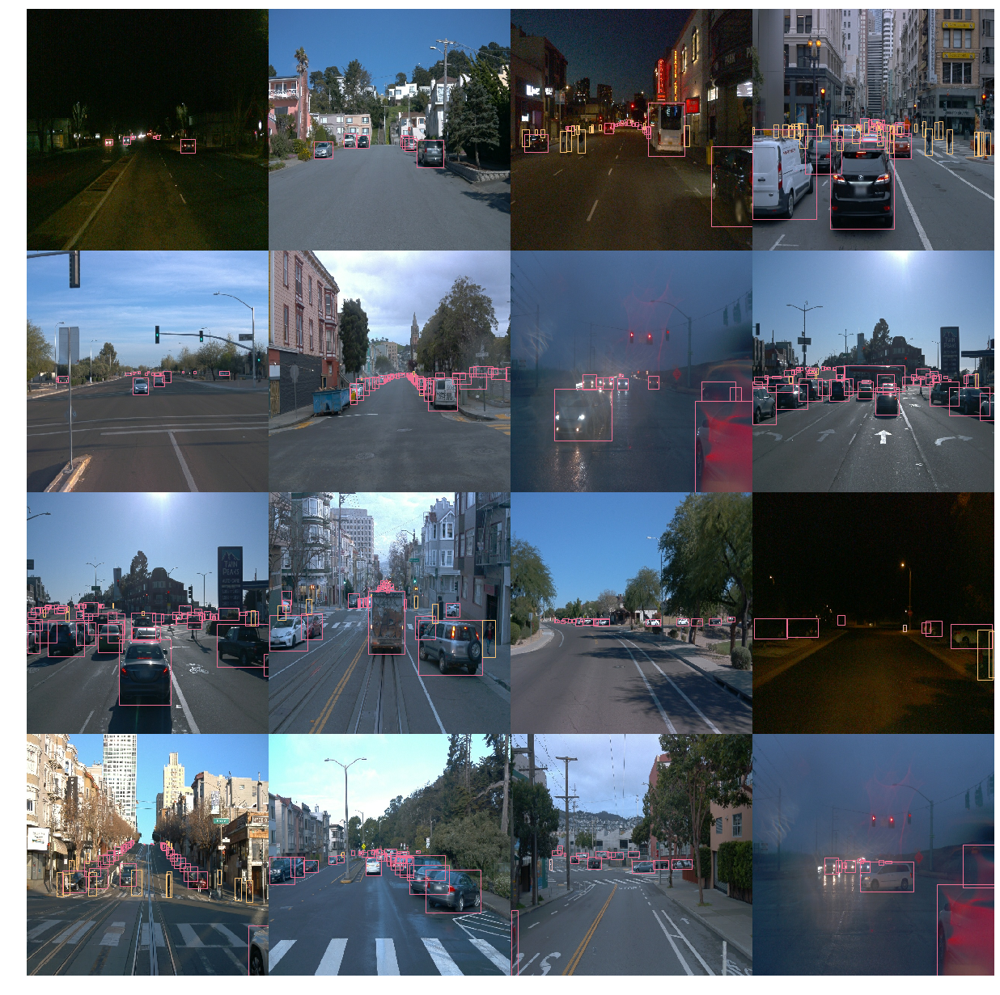
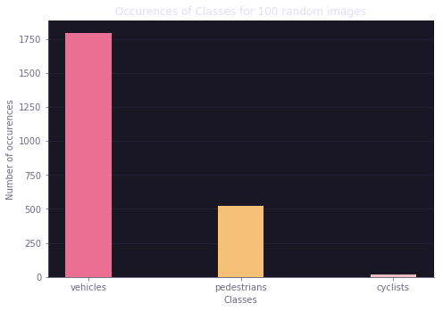
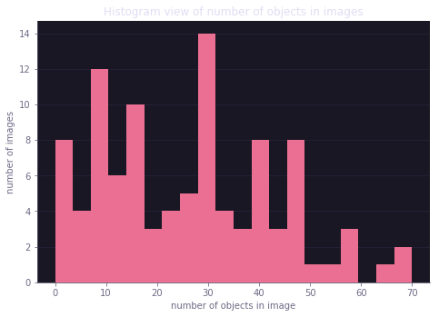
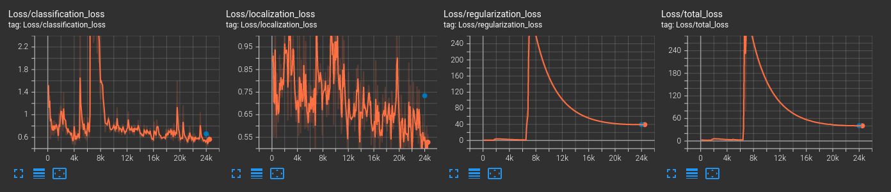
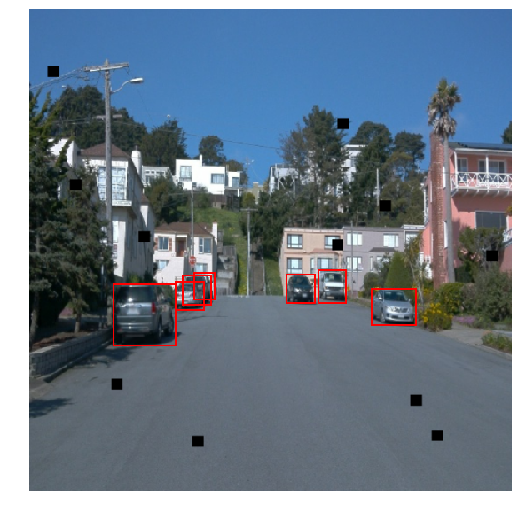
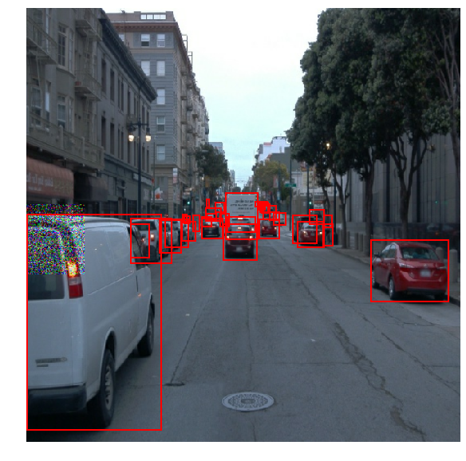
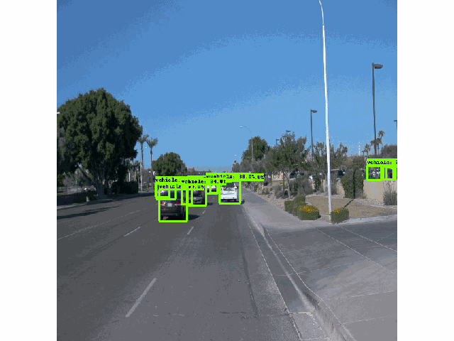

# Object Detection in an Urban Environment

### Project overview
The aim of this project is to leverage Tensorflow object detection pipeline to perform object detection on camera data from [Waymo](waimo.com/open) Urban driving dataset. Object detection is a powerful technique used in autonomous systems such as driverless cars to understand the surronding environment in planning and decision-making.

### Set up
The experiments were performed on a machine with a Nvidia GTX3080 GPU using the Docker Container included in the `build` directory, see the included README.MD on how to build and run the container. Keep in mind that in this guide I will refer to the paths used within the docker container.

#### Download and Split data from Waymo
The data is not included in this repo and has to be downloaded separately in order to reproduce the experiments. Make sure you have a google account registered to Waymo Open Dataset and you are logged in using `gsutils`. 

Downloads 100 `.tfrecords` used to perform the experiments:
```
python download_process.py --data_dir /app/project/data/
```

Split the data:
```
python create_splits.py --data_dir /app/project/data/
```

The resulting direcory structure in `/app/project/data` should now be:
```
data
├── processed
├── raw
├── test
├── train
└── val
```

#### Download pretrained model
SSD-Resnet50 model is used as a starting point for this project. The pretrained model files are not included in the repo and have to be downloaded form tensorflow [here](http://download.tensorflow.org/models/object_detection/tf2/20200711/ssd_resnet50_v1_fpn_640x640_coco17_tpu-8.tar.gz). Extract the archive and place the `ssd_resnet50_v1_fpn_640x640_coco17_tpu-8` directory in `/app/project/experiments/pretrained_model`.
```
experiments
├── augmentations_0
├── augmentations_1
├── augmentations_2
├── augmentations_3
├── augmentations_4
├── augmentations_5
├── pretrained_model
│  └── ssd_resnet50_v1_fpn_640x640_coco17_tpu-8
│     ├── checkpoint
│     └── saved_model
│        ├── assets
│        └── variables
└── reference
```

#### Run an experiment
Each experiment reported in this project can be replicated using the preconfigured `pipeline.config` file in the experimet's subdirectory.

Model training:
```
python experiments/model_main_tf2.py --model_dir=/app/project/experiments/<EXPERIMENT_DIR>/ --pipeline_config_path=/app/project/experiments/<EXPERIMENT_DIR>/pipeline_new.config
```

Model evaluation:
```
python experiments/model_main_tf2.py --model_dir=/app/project/experiments/<EXPERIMET_DIR>/ --pipeline_config_path=/app/project/experiments/<EXPERIMENT_DIR>/pipeline_new.config --checkpoint_dir=/app/project/experiments/<EXPERIMENT_DIR>/
```

Tensorboard plots:
```
python -m tensorboard.main --logdir experiments/<EXPERIMENT_DIR>/
```

### Dataset
#### Dataset analysis
Initial Dataset analysis was performed in the `Exploratory Data Analysis.ipynb` jupyer notebook. The dataset, which contains groundtruth bounding boxes for pedestrians, cyclists and cars, is somewhat challenging. The Driving scenarios are quite diverse: different places, weather conditions as well ifferent times of the day.



Moreover, additional data analysis show that the dataset in not well balanced as well: the classes are not well distributed with the majority of of objects in the image being vehicles, with very few cyclists!



Object quantity in each image is also not homogeneous at all: with images from highway driving containing only up to 20 objects while crowded city scenaris can contain as well up to 70 objects. 



#### Cross validation
Given the challenging problem and given there are not many raw training images (only 100 tfrecords), the decisioon was to create a cross-validation split of 70/15/15 for training, validation and final test dataset.

In my wiew, this would help in having enough variety in validation and testing datasets: in fact with smaller splits there may have been the possibility of having either test or validation splits with no pedestrians! Moreover, data augmentation will be leveraged to provide additional variety in training data.

### Training
#### Reference experiment

These are the validation results of the reference experimet:
|Metric                                                               | Results |
|---------------------------------------------------------------------|---------|
|Average Precision  (AP) @[ IoU=0.50:0.95  area=   all  maxDets=100 ] |  0.004  | 
|Average Precision  (AP) @[ IoU=0.50       area=   all  maxDets=100 ] |  0.010  |
|Average Precision  (AP) @[ IoU=0.75       area=   all  maxDets=100 ] |  0.002  |
|Average Precision  (AP) @[ IoU=0.50:0.95  area= small  maxDets=100 ] |  0.003  |
|Average Precision  (AP) @[ IoU=0.50:0.95  area=medium  maxDets=100 ] |  0.022  |
|Average Precision  (AP) @[ IoU=0.50:0.95  area= large  maxDets=100 ] |  0.016  |
|Average Recall     (AR) @[ IoU=0.50:0.95  area=   all  maxDets=  1 ] |  0.005  |
|Average Recall     (AR) @[ IoU=0.50:0.95  area=   all  maxDets= 10 ] |  0.016  |
|Average Recall     (AR) @[ IoU=0.50:0.95  area=   all  maxDets=100 ] |  0.037  |
|Average Recall     (AR) @[ IoU=0.50:0.95  area= small  maxDets=100 ] |  0.008  |
|Average Recall     (AR) @[ IoU=0.50:0.95  area=medium  maxDets=100 ] |  0.122  |
|Average Recall     (AR) @[ IoU=0.50:0.95  area= large  maxDets=100 ] |  0.162  |

Here is the training graph:



Here is a discussion of the results: from the training graph hitting a plateau at ~20k steps we can see how the model struggles to fit the data, this is moreso evident from the validation metrics show a **Recall** of a little more than 10% form medium-large bboxes !

#### Improve on the reference

To improve on the model performance, the results from the reference were used to gain some insigth:

* The first intuition was to leverage data augmetation to make the model more resiliant to **obstructions** of the objects, in fact that could be why the reference experiment performed so poorlywith very low recall. Solutions were explored in the `Explore augmentations.ipynb` notebook by applying random black pathes and later on gaussian patches on the input image. We will later show gaussian patches to provide better results, in hindsight this makes sense as they do not fully hide the underlaying features.

 Black Patches             |  Gaussian Patches
:-------------------------:|:-------------------------:
        |  

* The second intuition was to try leveraging another optimizer, in particular the choice was the **Adam** optimizer (wich improves over the one used in the reference experiment by using an adaptive momentum), as well by using a much lower **learning rate** while increasing the **batch size** to avoid overfitting.

Also, experiments with random crops plus gamma adjusmets were carried out but the results were quite lacking during validation.

Therefore, the following experiments were carried out as modifications of the reference pipeline configuration:

| Experiment         | optimizer | learning rate | batch size | black patches | gaussan patches | random crops + resizes |
|--------------------|-----------|---------------|------------|---------------|-----------------|------------------------|
| **augmentations_0**| momentum  | warmup + decaying 0.04 | 2| X              |                 |                        |
| **augmentations_1**| adam      | warmup + decaying 0.04 | 2| X              |                 |                        |
| **augmentations_2**| momentum  | warmup + decaying 0.04 | 2|                |                 | X                      |
| **augmentations_3**| adam      | decaying 0.01          | 4| X              |                 |                        |
| **augmentations_4**| adam      | decaying 0.01          | 4|                |                 | X                      |
| **augmentations_5**| adam      | decaying 0.01         | 5|                | X               |                        | 

This table sums the **validation results**

|Metric                                                               | 0 | 1 | 2 | 3 | 4 | 5 |
|---------------------------------------------------------------------|---|---|---|---|---|---|
|Average Precision  (AP) @[ IoU=0.50:0.95  area=   all  maxDets=100 ] |0.014|0.000|0.040|0.072|0.000|**0.080**|
|Average Precision  (AP) @[ IoU=0.50       area=   all  maxDets=100 ] |0.031|0.001|0.076|0.164|0.000|**0.170**|
|Average Precision  (AP) @[ IoU=0.75       area=   all  maxDets=100 ] |0.011|0.000|0.039|0.061|0.000|**0.068**|
|Average Precision  (AP) @[ IoU=0.50:0.95  area= small  maxDets=100 ] |0.006|0.000|0.011|0.027|0.000|**0.029**|
|Average Precision  (AP) @[ IoU=0.50:0.95  area=medium  maxDets=100 ] |0.052|0.011|0.127|0.220|0.004|**0.225**|
|Average Precision  (AP) @[ IoU=0.50:0.95  area= large  maxDets=100 ] |0.075|0.001|0.174|0.239|0.001|**0.285**|
|Average Recall     (AR) @[ IoU=0.50:0.95  area=   all  maxDets=  1 ] |0.008|0.000|0.013|0.018|0.000|**0.021**|
|Average Recall     (AR) @[ IoU=0.50:0.95  area=   all  maxDets= 10 ] |0.024|0.001|0.047|0.086|0.001|**0.092**|
|Average Recall     (AR) @[ IoU=0.50:0.95  area=   all  maxDets=100 ] |0.050|0.008|0.080|0.138|0.006|**0.147**|
|Average Recall     (AR) @[ IoU=0.50:0.95  area= small  maxDets=100 ] |0.010|0.000|0.034|0.068|0.000|**0.074**|
|Average Recall     (AR) @[ IoU=0.50:0.95  area=medium  maxDets=100 ] |0.164|0.011|0.225|0.352|0.005|**0.373**|
|Average Recall     (AR) @[ IoU=0.50:0.95  area= large  maxDets=100 ] |0.226|0.150|0.231|0.381|0.117|**0.397**|

The smoothed training from the adam optimizer plus the introduction of gaussian patches gives by far the best improvements over the reference experiment. The model still struggles with small objects, but the recall for medium to large ojcets improved from ~15% to **almost 40%**.

### Test Results

Finally, the best trained model was exported and validated on the **test dataset**, here is a gif animation of the model on one of the unseen tfrecords:


